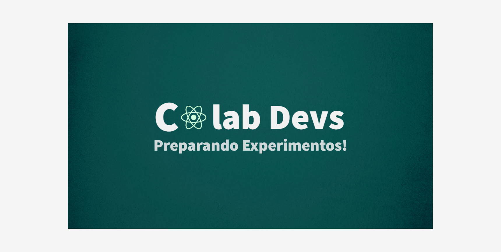

<h1 align="center">
   
   # Olá! eu sou o Marcos Vini! Seja Bem vindo 🌎😊 
   
</h1>
   <br/>
   
   
   <br/>
   
<a href="https://wa.me/556999732942">
   
   <p>Entre em Contato</p>
</a>

<a href="https://bit.ly/3GZOZJ4">Meus Links</a>

<h1 align="center">


</h1>


//

<br/>


<!--    -->
  <br/>

   <div align="left" >👩‍🚀 
      Olá, Me Marcos Vinicius, Tenho 22 Anos e Sou Apaixonado por Tecnologia e como a <br> construção delas ajudam milhares de Pessoas Atualmente.<br/>
       Eu Sempre digo que a melhor forma de você aprender é ensinando e como a Educação pode mudar muitas Realidades! <br/>
       Bolsista Na Rocketseat estudo a Trilha de React.js - construção de interfaces. <br/>
       "Em um mundo onde a informação fica obsoleta cada vez mais rápido, velocidade de aprendizado é a chave para o sucesso".<br/>
      - Sou técnico em informática no Hospital Unimed Porto Velho. <br/>
      -  Analise de suporte computacional; <br/>
      - Analise técnica e corretiva de erros em SO's e softwares em geral (Help desk); <br/>
      - Analise de Processos No Sistema Mv - Software de Gestão Hospitalar; <br/>
      - Suporte/Analise/Ensino de como criar uma prescrição Médica no Mv. <br/>
      - Criação de Usuários ao Sistema Hospitalar. <br/>
      - Informática empresarial; <br/>
      - Suporte Técnico; <br/>
      - Manutenção e limpeza de hardwares; <br/>
      - Familiarizado com Infra estrutura de Redes. <br/>
      - Marketing Digital. <br/>
      - Empreendedorismo 
   </div>
 
<br/>


###  A little more about me...  


```javascript
const stack = {
    askMeAbout: ["web dev", "help Desk", "analysis"],
    technologies:{
        backEnd: ["nodejs", "express"],
        fronEnd: ["Javascript", "React.js", "Next.js", "TypeScript", "Html5", "Css3", "SASS", "Bootstrap", "Materialize"],
        database: ["FaunaDb","mySql"],
        misc: ["Firebase", "Prismic"],
        Sos: ["Windows", "Linux"]
    },
}
```
 
 <p  align="left">  </p>

 
<div>  
   - ✔  Trabalho como tecnico de TI prestando suporte em sistemas do Hospital unimed Porto Velho desde 2019 até os dias Atuais <br/>
   - 👩‍🚀 No Ano de 2018 Conclui o estágio pela Procuradoria Geral do Estado na parte de Dev front End durante 3 meses pelo Estagio Obrigatório. <br/>
   - 🐱‍ Atualmente estudo Front-end como base de desenvolvimento web <br/>
   - 🐱‍👤 tecnologias que estudo atualmente: React.js, html, css, javascript,  typescript, next.js, um pouco de node.js, git, github.<br/>
   - 🛢  Outras Ferramentas: gitkrakren, figma, Adobe cloud express, whinscall, trello <br/>
   - 🐱‍🏍 Tecnologias  que tenho a intenção de estudar também: Firebase, banco de dados PostgreSQL, python, chakra UI, Tailwind <br/>
</div>

 <br />
 
 

<div   align="center" >
  <a href="https://github.com/marcoscode404">
  
  
</div>
 
 <br />

  
<!-- imagens das linguagens  -->
 <div style="display: inline_block"><br>
  <h2>🛠 Tecnologias</h2>
  
  
  
  
  
  
  
  
  
  
  
 
   </br>
  
</div>
   </br>
   
  
<!--  / -->
  
  
<!-- redes sociais   -->
  <div>
   <h2>🎥 Redes Sociais!</h2>
    <a href="#" target="_blank"></a>
  <a href="https://instagram.com/marcosviniicode" target="_blank"></a>
 	<a href="#" target="_blank"></a>
 <a href="https://discord.com/channels/@me" target="_blank"></a> 
  <a href = "https://marcosviniciuspgerogov253@gmail.com"></a>
  <a href="https://www.linkedin.com/in/marcos-vini-code-984903181/" target="_blank"></a> 
   <a href="https://www.facebook.com/Marcos.Code1999/" target="_blank"></a>
  </div>
 
  <div>
    <a href="#" target="_blank"></a>
    <a href="https://www.facebook.com/Marcos.Code1999/" target="_blank"></a>
    
  </div>
<!-- /  -->
<br/>

<br/>

<h4 align="center">Visitor's count :eyes:</h4>

<p align="center"></p>


 </br>
 


 ##
 [](https://github.com/ashutosh00710/github-readme-activity-graph&theme=dracula)
 
 ##
 </br>
 
<!--  cobrinha  -->
  
  
  
  
