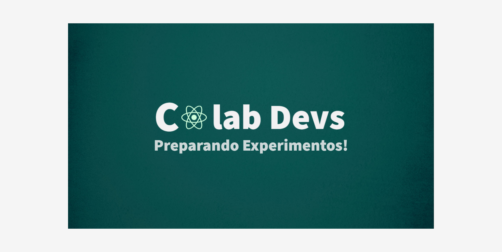

<h1 align="center">
   
    Olá! eu sou o Marcos Vini! Seja Bem vindo 🌎😊    
</h1>

   <br/>
   ULTIMA ATUALIZAÇÂO - 01/06/2025
   
   
   <br/>
   
<!-- <a href="https://wa.me/556999732942">
   
   <p>Entre em Contato</p>
</a>
-->

[](https://git.io/typing-svg)
<br/>

<!--

>-->

<!--    -->
  <br/>

   <div align="left" >👩‍🚀 
       Olá, Me Marcos Vinicius, Trabalho a mais de 3 anos como Desenvolvedor Front-end, desenvolvendo varias interfaces para a area de logistica
       usando tecnologias como javascript/typescript, tailwind, vue/nuxt, react.
       Tenho 25 Anos e Sou Apaixonado por Tecnologia e como a <br> construção delas ajudam milhares de Pessoas Atualmente.<br/>
       Eu Sempre digo que a melhor forma de você aprender é ensinando e como a Educação pode mudar muitas Realidades! <br/>
      <br/>
      <br/>      
      <br/>
      
      Trabalhei por mais de 3  anos como Técnico em Infórmatica no Hospital Unimed Porto Velho Ro
      - Analise técnica e corretiva de erros em SO's e softwares em geral (Help desk); <br/>
      - Analise de Processos No Sistema Mv - Software de Gestão Hospitalar; <br/>
      - Suporte/Analise/Ensino de como criar uma prescrição Médica no Mv. <br/>
      - Criação de Usuários ao Sistema Hospitalar. <br/>
      - Informática empresarial; <br/>
      - Suporte Técnico; <br/>
      - Manutenção e limpeza de hardwares; <br/>
      - Familiarizado com Infra estrutura de Redes. <br/>
      - Marketing Digital. <br/>
      - Empreendedorismo 
   </div>
 
<br/>


###  A little more about me...  


```javascript
const stack = {
    askMeAbout: ["web dev", "help Desk", "analysis"],
    technologies:{
        backEnd: ["python","nodejs", "express"],
        fronEnd: ["Javascript", "React.js", "Next.js", "TypeScript", "Html5", "Css3", "SASS", "Bootstrap", "Materialize"],
        database: ["FaunaDb","mySql"],
        misc: ["Firebase", "Prismic"],
        Sos: ["Windows", "Linux"]
    },
}
```
 
 <p  align="left">  </p>

 
<div>  
   - ✔  Trabalhei como tecnico de informatica prestando suporte em sistemas do Hospital unimed Porto Velho desde 2019 até 01/08/2022 <br/>
   - 👩‍🚀 No Ano de 2018 Conclui o estágio pela Procuradoria Geral do Estado na parte de Dev front End durante 3 meses pelo Estagio Obrigatório. <br/>
   - 🐱‍ Atualmente estudo Front-end como base de desenvolvimento web <br/>
   - 🐱‍👤 tecnologias que estudo atualmente: React.js, html, css, javascript,  typescript, next.js, um pouco de node.js, git, github.<br/>
   - 🛢  Outras Ferramentas: gitkrakren, figma, Adobe cloud express, whinscall, trello <br/>
   - 🐱‍🏍 Tecnologias  que tenho a intenção de estudar também: Firebase, banco de dados PostgreSQL, python, chakra UI, Tailwind <br/>
</div>

 <br />
 
<div   align="center" >
  <a href="https://github.com/marcoscode404">
  
  
</div>
 
 <br />

  
<!-- imagens das linguagens  -->
<h1 align="center">Hi 👋, I'm Marcos Vinicius Marques Gomes</h1>
<h3 align="center">A passionate frontend developer from Brazil</h3>

- 🌱 I’m currently learning **Python**

- 💬 Ask me about **Vue, Nuxt, javaScript**

<h3 align="left">Connect with me:</h3>
<p align="left">
</p>

<h3 align="left">Languages and Tools:</h3>

</br>

<div align="center" >
      <a href="https://skillicons.dev"   >
        
      </a>
        <br />
  </div>
<!-- /  -->

<h4 align="center">Visitor's count :eyes:</h4>

<p align="center"></p>
 </br>
 


